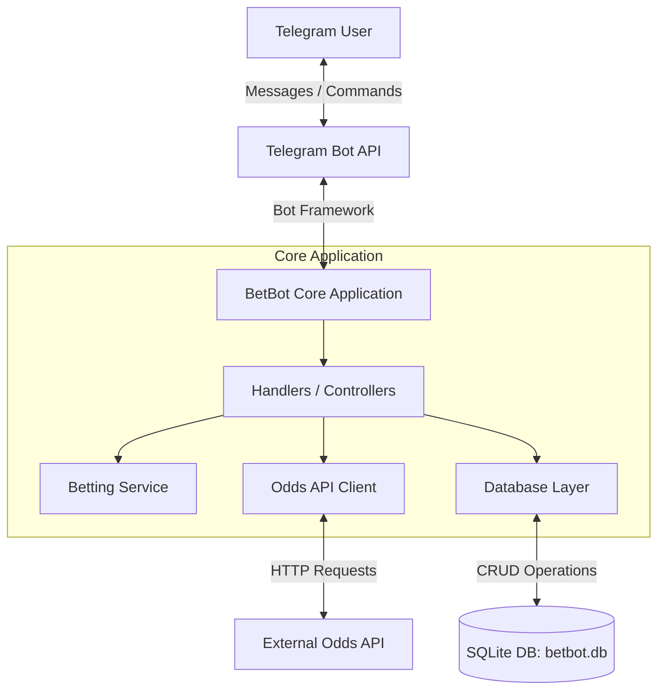
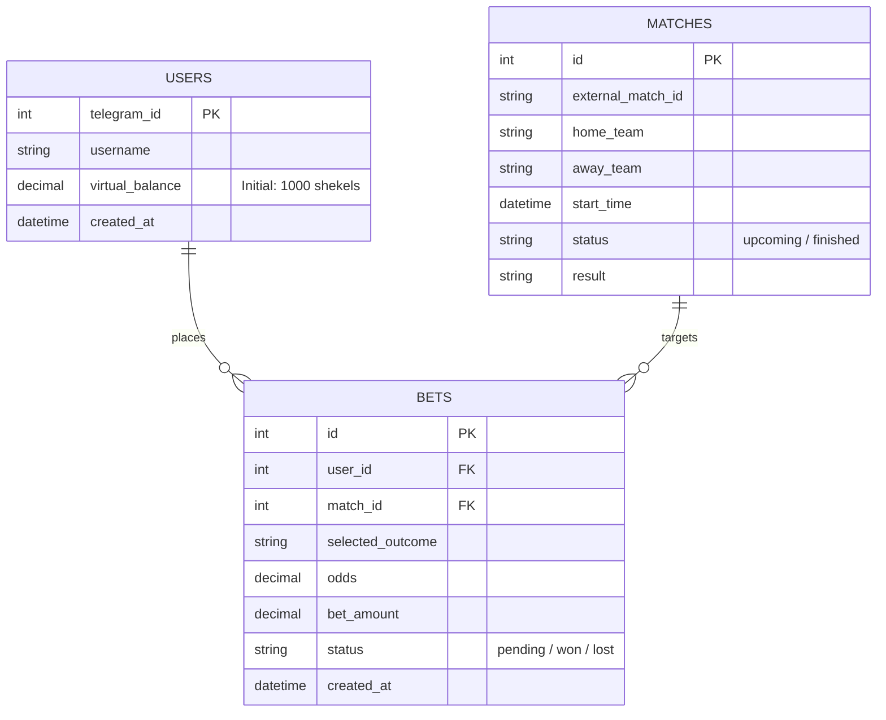

```python
"""
BetBot Configuration Module.

Reads environment variables from the .env file and sets core application settings.

===============================================================================
SYSTEM ARCHITECTURE & LOGIC (Mermaid)
===============================================================================

1. High-Level Architecture Diagram:


2. Entity Relationship Diagram (ERD):



===============================================================================
"""

import os
from dotenv import load_dotenv

# Load environment variables from .env file

load_dotenv()

BOT_TOKEN = os.getenv("BOT_TOKEN")
ODDS_API_KEY = os.getenv("ODDS_API_KEY")

# Comma-separated Admin Telegram IDs in .env, e.g.: ADMIN_IDS=123456789,987654321

_admin_ids_raw = os.getenv("ADMIN_IDS", "")
ADMIN_IDS = [int(x.strip()) for x in _admin_ids_raw.split(",") if x.strip()]

START_BALANCE = 1000

CURRENCY_NAME = "shekels"

# Path to the SQLite database file

DB_PATH = "betbot.db"

# Default sport key fetched from The Odds API.

# See available sport keys here: https://the-odds-api.com/sports-odds-data/sports-apis.html

# soccer_fifa_world_cup — World Cup, can be changed/extended later

DEFAULT_SPORT_KEY = "soccer_fifa_world_cup"

# Bookmaker region to fetch odds for (eu — European bookmakers)

ODDS_REGION = "eu"

if not BOT_TOKEN:
raise RuntimeError(
"BOT_TOKEN not found. Create a .env file based on .env.example and add your bot token."
)

```

```
