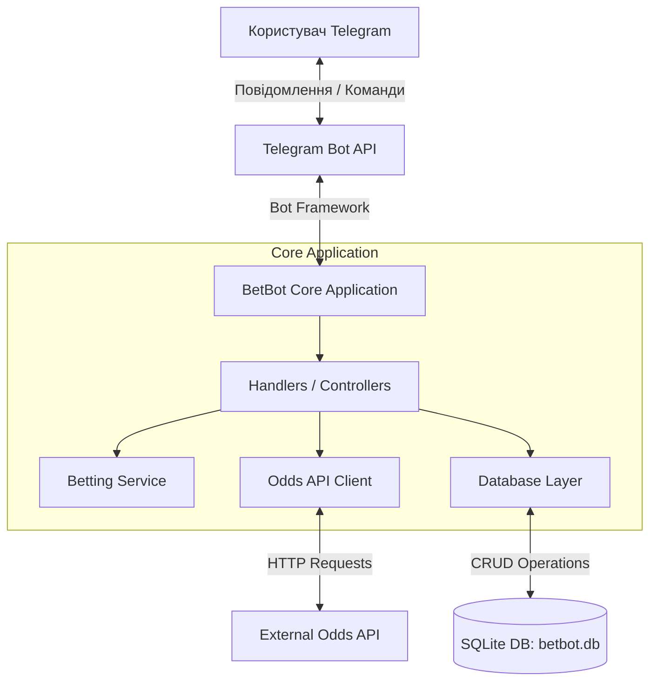
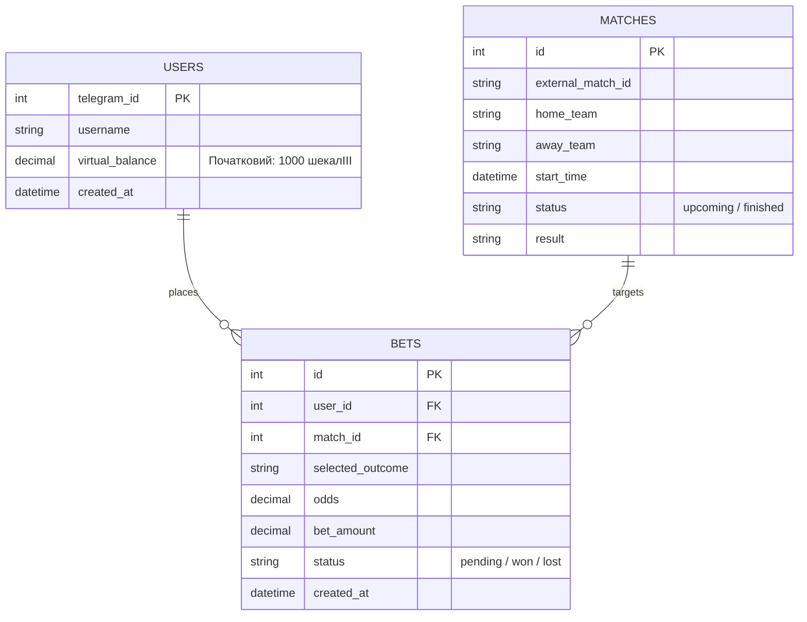

```python
"""
Модуль конфігурації BetBot.

Зчитує змінні середовища з файлу .env та задає основні налаштування бота.

===============================================================================
АРХІТЕКТУРА ТА ЛОГІКА РОБОТИ (Mermaid)
===============================================================================

1. Загальна архітектура системи:


2. Схема даних (ER Diagram):



===============================================================================
"""

import os
from dotenv import load_dotenv

# Завантаження змінних оточення з .env

load_dotenv()

BOT_TOKEN = os.getenv("BOT_TOKEN")
ODDS_API_KEY = os.getenv("ODDS_API_KEY")

# Telegram ID адміністраторів через кому в .env, наприклад: ADMIN_IDS=123456789,987654321

_admin_ids_raw = os.getenv("ADMIN_IDS", "")
ADMIN_IDS = [int(x.strip()) for x in _admin_ids_raw.split(",") if x.strip()]

START_BALANCE = 1000

CURRENCY_NAME = "шекалІІІ"

# Шлях до файлу бази даних SQLite

DB_PATH = "betbot.db"

# Який вид спорту тягнути з The Odds API за замовчуванням.

# Список ключів спорту дивись тут: https://the-odds-api.com/sports-odds-data/sports-apis.html

# soccer_fifa_world_cup — ЧМ, можна змінити/розширити пізніше

DEFAULT_SPORT_KEY = "soccer_fifa_world_cup"

# Регіон букмекерів, коефіцієнти яких тягнемо (eu — європейські контори)

ODDS_REGION = "eu"

if not BOT_TOKEN:
raise RuntimeError(
"BOT_TOKEN не знайдено. Створи файл .env на основі .env.example і впиши туди токен бота."
)

```

```
