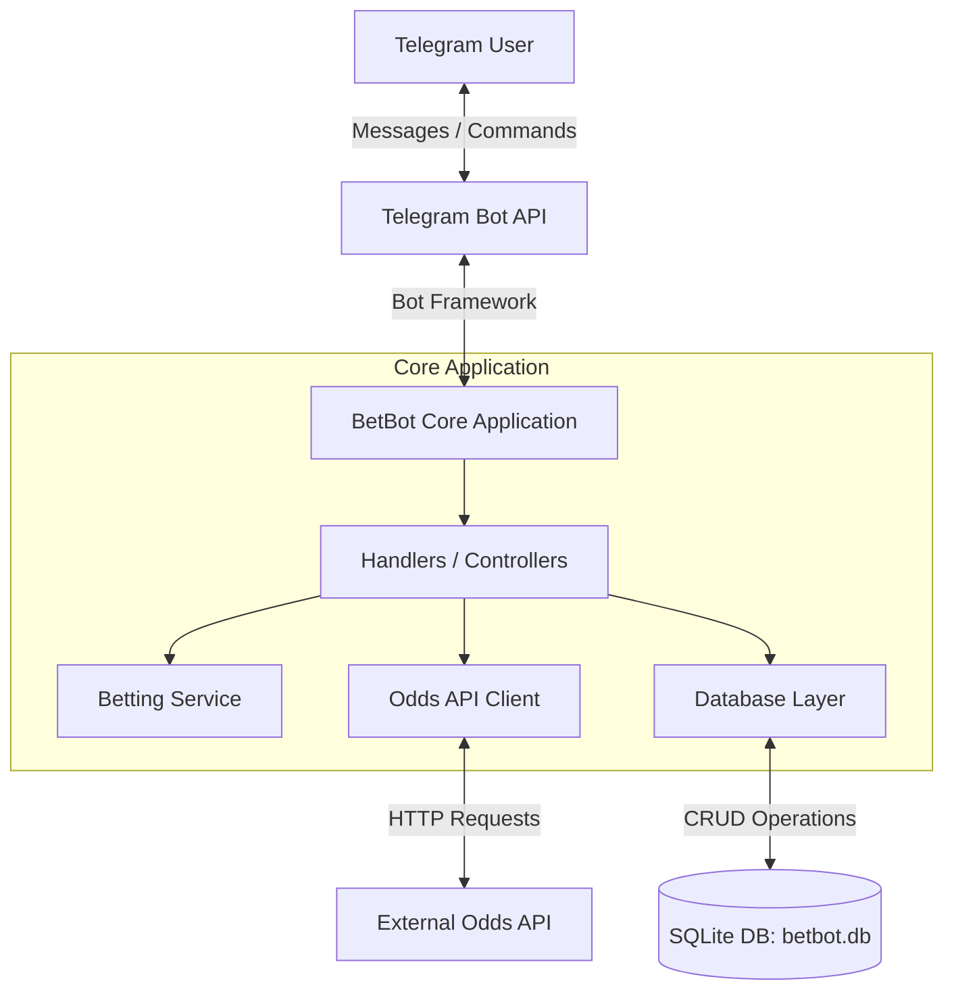
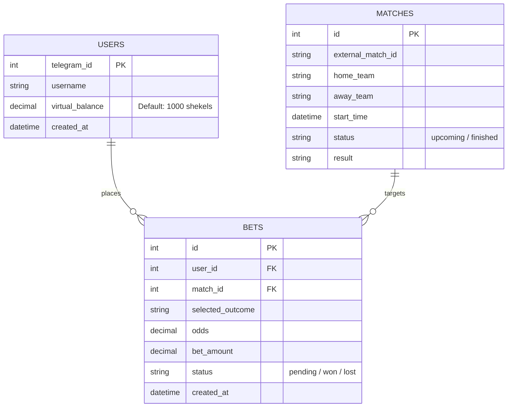

```markdown
# BetBot — Virtual Currency Betting Telegram Bot

A feature-rich Telegram bot built in Python for virtual currency sports betting. **BetBot** allows users to place bets on live sports events using real-time odds provided by [The Odds API](https://the-odds-api.com/).

---

## Features

* **Virtual Economy:** Users start with a predefined balance (`1,000 shekels`) to place risk-free bets.
* **Real-time Odds Integration:** Fetches up-to-date match fixtures and bookmaker odds via The Odds API.
* **Bet Management:** Track open (pending) and settled (won/lost) bets.
* **Leaderboards & User Statistics:** Check balances, betting histories, and ranking among users.
* **Admin Controls:** Dedicated commands for managing users, updating match outcomes, and adjusting balances.

---

## Architecture & Data Model

### 1. High-Level Architecture



---

### 2. Entity-Relationship Diagram (ERD)



---

## Tech Stack

* **Language:** Python 3.10+
* **Database:** SQLite
* **External Services:**
* [Telegram Bot API](https://core.telegram.org/bots/api)
* [The Odds API](https://the-odds-api.com/)


* **Environment Management:** `python-dotenv`

---

## Getting Started

### Prerequisites

* Python 3.10 or higher
* A Telegram Bot Token (obtained from [@BotFather](https://t.me/BotFather))
* An API key from [The Odds API](https://the-odds-api.com/)

### Installation

1. **Clone the repository:**
```bash
git clone [https://github.com/dDaijin/betkabot.git](https://github.com/dDaijin/betkabot.git)
cd betkabot

```


2. **Create and activate a virtual environment:**
```bash
python -m venv venv
# On Windows:
venv\Scripts\activate
# On macOS/Linux:
source venv/bin/activate

```


3. **Install dependencies:**
```bash
pip install -r requirements.txt

```


4. **Set up Environment Variables:**
Copy `.env.example` to `.env` and fill in your credentials:
```bash
cp .env.example .env

```


Configure `.env` as follows:
```env
BOT_TOKEN=your_telegram_bot_token_here
ODDS_API_KEY=your_odds_api_key_here
ADMIN_IDS=123456789,987654321

```


5. **Run the Bot:**
```bash
python main.py

```


---

## Configuration Parameters

Key settings can be modified in `config.py`:

| Parameter | Default Value | Description |
| --- | --- | --- |
| `START_BALANCE` | `1000` | Starting virtual balance for new users |
| `CURRENCY_NAME` | `"shekels"` | Custom virtual currency unit |
| `DB_PATH` | `"betbot.db"` | Path to SQLite database file |
| `DEFAULT_SPORT_KEY` | `"soccer_fifa_world_cup"` | Default sport category for odds |
| `ODDS_REGION` | `"eu"` | Bookmaker region filter (`eu`, `us`, `uk`, `au`) |

---

## License

This project is open-source and available under the [MIT License](https://www.google.com/search?q=LICENSE).

```

```
